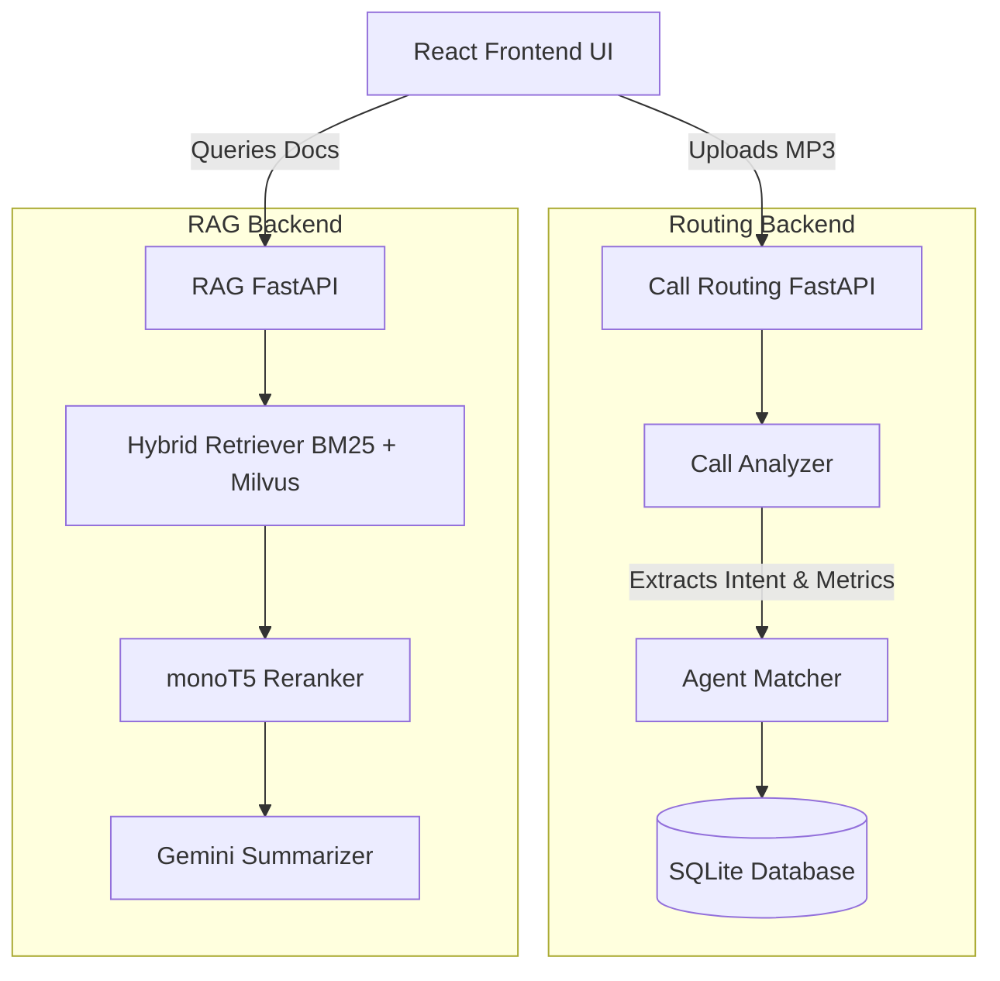

# GenCallAI: AI Call Routing & Document RAG Platform

<p align="center">
  <em>An end-to-end AI platform optimizing BPO call routing via hybrid sentiment and accelerating query resolution via hybrid RAG.</em>
</p>

---

## 📖 Overview

GenCallAI is a comprehensive, production-ready AI platform designed to transform how BPO (Business Process Outsourcing) centers handle customer calls. By fusing cutting-edge Natural Language Processing (NLP) with real-time audio metrics, GenCallAI intelligently routes calls to the best-suited agents while providing those agents with a robust semantic search interface to resolve customer queries instantly.

### Core Capabilities (As featured on my CV)
- **Dual-Modal Engine**: Fuses **TextBlob NLP** and **librosa metrics** (RMS/MFCCs) to evaluate 4 distinct customer call metrics seamlessly.
- **Real-Time Intent Extraction**: Utilizes **spaCy NER** and **KeyBERT** to feed a custom **`heapq` priority queue**, optimizing call routing across 6 complex variables.
- **Hybrid RAG Pipeline**: Built with **LangChain**, **BM25**, a **384-dimensional Milvus vector search**, and **monoT5 reranking** for exact contextual relevance.
- **Full-Stack Architecture**: Operationalized into an end-to-end application with a premium **React frontend**, 2 **FastAPI microservices**, and an **SQLite** database layer.

---

## 🏗 System Architecture

The platform relies on a distributed microservice architecture.



---

## 🛠 Tech Stack

### Frontend
- **React.js (Vite)**: High-performance, reactive UI.
- **CSS3**: Premium glassmorphism and modern UI aesthetics.

### Backend 1: Call Routing
- **FastAPI**: Asynchronous Python API.
- **Audio Processing**: `pydub`, `librosa`, `speechrecognition`.
- **NLP & AI**: `spaCy`, `KeyBERT`, `TextBlob`, `transformers`.
- **Database**: `SQLite`.

### Backend 2: Hybrid RAG
- **FastAPI**: Asynchronous Python API.
- **Vector Search**: `Milvus` (PyMilvus).
- **RAG Orchestration**: `LangChain`, `sentence-transformers`.
- **Summarization**: `Google Gemini GenAI`.

---

## 🚀 Getting Started

Follow these instructions to get the platform running locally.

### 1. Initialize the Environment
The repository comes with an automated bash script to set up virtual environments and install all dependencies for both microservices.

```bash
# Set up the Python backends
bash setup.sh
```

### 2. Start the Microservices

**Call Routing API** (Runs on port `8000`)
```bash
cd routing_api
source venv/bin/activate
uvicorn api:app --reload --port 8000
```

**RAG Semantic Search API** (Runs on port `8001`)
*(Note: You will need to create a `.env` file in the `rag_api` directory with your Gemini and Milvus credentials for full capability)*
```bash
cd rag_api
source venv/bin/activate
uvicorn src.api:app --reload --port 8001
```

### 3. Start the Frontend Application
```bash
cd frontend
npm install
npm run dev
```

Navigate to `http://localhost:5173` in your browser. The frontend gracefully falls back to mock data if the backend servers are unavailable or missing API keys.

---

## 📂 Project Structure

- `/frontend`: The Vite-powered React UI providing dashboard views, audio uploads, and chat interfaces.
- `/routing_api`: Houses the `CallAnalyzer`, speech-to-text integration, and intelligent `heapq` agent assignment logic.
- `/rag_api`: The document retrieval module. Drop PDFs in `rag_api/raw_documents` to chunk, embed, and index them.

---

## 🔒 License
Developed by Piyush Bisht.
